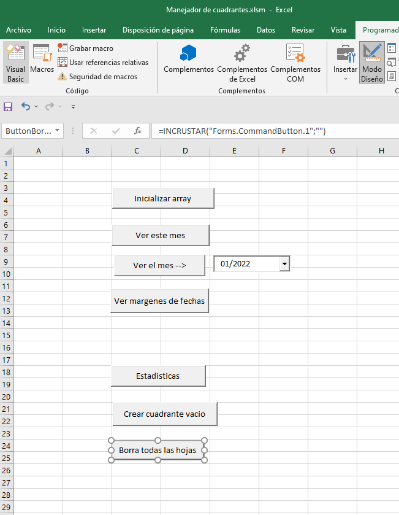
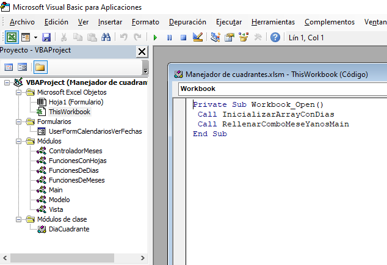
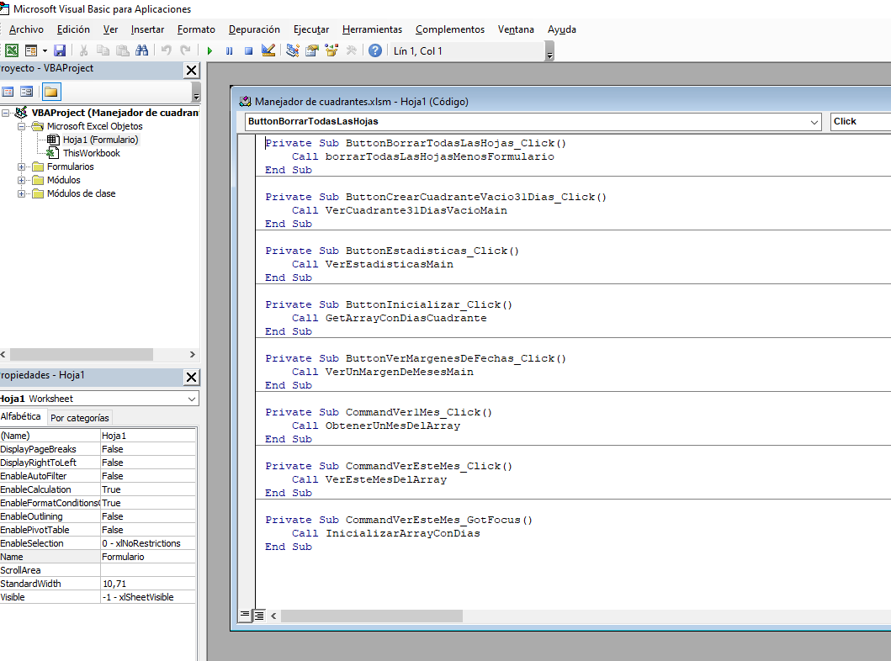

# Manejador de cuadrante

Sistema para la creación de turnos de trabajo

La hoja 1 (Formulario) tiene insertados los siguiente controles de formulario:

 

Al abrir el libro Inicializamos los arrays y rellenamos los cuadros combinados (combobox);

 

En visual Basic aparecen las siguientes llamadas a métodos:

 

Las subrutinas se encuentran repartidas en los difentes archivos de la carpeta módulos.